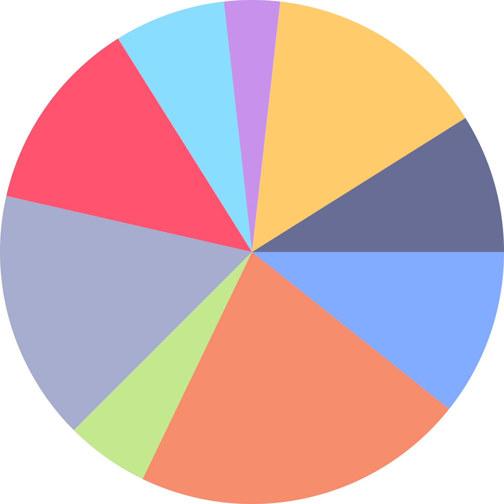

# CustomPainter 101

Repo related to CustomPainter 101 talk at Flutter Festival Catania ([Link alle slide](https://docs.google.com/presentation/d/1MgaR0Oqe9pUTnA4khUgaTNRrgQ75iisjONiHbQXwALI/edit?usp=sharing))

## Shown CustomPainter cases:
### Hystogram

### Pie

### Line

### Flutter Logo 

